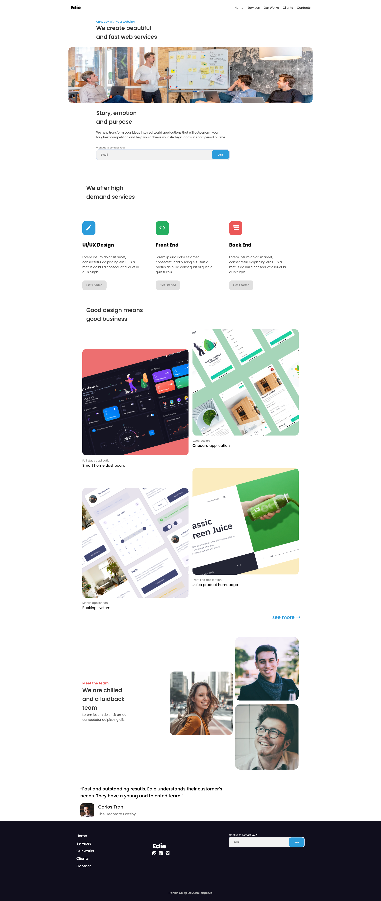

<!-- Please update value in the {}  -->

<h1 align="center">My Gallery</h1>

   Solution for a challenge from  <a href="http://devchallenges.io" target="_blank">Devchallenges.io</a>.

  <h3>
    <a href="https://rohit-edie-homepage.netlify.app/">
      Demo
    </a>
     | 
    <a href="https://github.com/rohitgbg/Edie-Homepage">
      Solution
    </a>
     | 
    <a href="https://devchallenges.io/challenges/xobQBuf8zWWmiYMIAZe0">
      Challenge
    </a>
  </h3>

